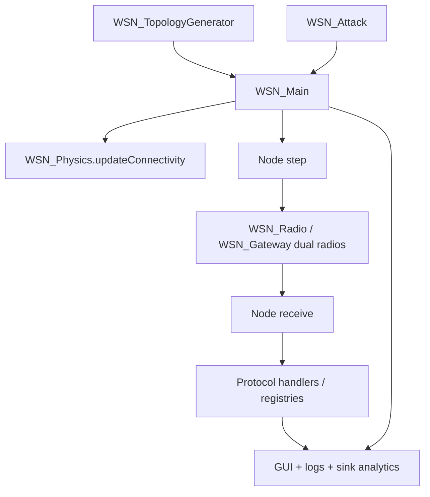

# 🎯 WSN7 Modular Wireless Sensor Network Simulator

MATLAB-based wireless sensor network simulator with hierarchical routing, dual-radio gateways, live GUI inspection, and built-in attack modeling.


> This README reflects the current codebase. `SPECIFICATION.md` contains historical notes, and `AI_ENGINE_DEBUG_PROMPT.md` is outdated.

## 🌐 Overview

This repository implements a wireless sensor network simulator in MATLAB with four main node roles: sensors, cluster heads, gateways, and a sink/root controller. The simulator runs a timestep-based network model, computes radio reachability from physics, routes packets through a hierarchical protocol stack, and visualizes both normal traffic and adversarial behavior in a live GUI.

Key capabilities include:

- Hierarchical node recruitment and parent/child routing.
- Dual-radio gateway behavior for backbone and access traffic.
- Periodic hello bursts, heartbeats, sensor reporting, aggregation, and ACK handling.
- Attack injection for flooding, panic flooding, Sybil, black hole, wormhole, grayhole, and denial-of-sleep scenarios.
- Live topology, packet, log, and sink analytics visualization.
- CSV export for logs, training data, and attack ground truth.

## 🧠 Architecture Overview

The simulator is organized around a layered node model and a timestep dispatcher.

### Node Hierarchy

- `WSN_Node` is the base class for all network entities.
- `WSN_Sensor` is the tier-1 leaf node that produces sensor values and can enter orphan sleep mode.
- `WSN_ClusterHead` is the tier-2 aggregator that recruits children, aggregates sensor data, and forwards to its parent.
- `WSN_Gateway` is the tier-3 infrastructure node with a backbone radio and a separate access radio.
- `WSN_Sink` is a gateway specialization that acts as the root controller and terminates routing/analytics.

The topology generator assigns IDs and positions, then instantiates the correct class for each node. The sink is a dedicated root object, while the broader infrastructure tier remains tier 3 in the topology model.

### Control Flow



### Data Flow

1. `WSN_Main` creates or reuses a topology, initializes the attack state, and starts the GUI.
2. Every timestep, the simulator refreshes radio connectivity with `WSN_Physics.updateConnectivity`.
3. Each node generates messages in its `step()` method.
4. Generated messages are serialized to wire format, queued, delivered by adjacency rules, and then deserialized on receipt.
5. Node-specific `receive()` handlers update routing state, registries, sensor analytics, or attack behavior.
6. The GUI renders the topology, packet traces, attack overlays, network table, logs, and sink charts.
7. At the end of a run, attack ground truth can be exported to CSV.

### Communication Model

- Broadcast and multicast are resolved by destination rules plus adjacency reachability.
- Access traffic uses the normal radio path and is subject to fading via `physAdj`.
- Gateway-to-gateway backbone traffic uses a stable backbone path via `stblAdj`.
- `WSN_Radio` enforces half-duplex behavior, one TX request per tick, and a single pending RX slot.
- Gateway nodes own two independent radios: backbone and access. The access radio handles CH handshake traffic, sensor access traffic, and gateway-to-sensor communication.

### Simulation Loop

The main timeline is implemented in `WSN_Main.m`:

- `t = 0-20`: gateway boot and discovery window.
- `t = 21-200`: gateway recruitment and hello collection.
- `t = 200+`: cluster-head recruitment opens.
- `t = 350+`: sensor reporting begins.
- `t = 10000` by default: total simulation length.

`WSN_Main` also exports logs every 250 timesteps and writes an attack summary CSV at the end of a malicious run.

### Protocol Map

The current implementation uses these message types:

| Type | Name | Current use |
| --- | --- | --- |
| 0 | HELLO | Neighbor discovery. Payload is tier, battery, neighbor count. Broadcast as `FFFF`. |
| 1 | SENSOR_DATA | Raw sensor readings from sensors to CHs or GWNs. |
| 2 | PANIC | Emergency / anomaly messages with TTL, priority, and payload. |
| 5 | CH_HELLO / SENSOR_AGG / AGG_ACK | CH routing updates, aggregated sensor batches, and ACKs. Subtypes `5.0/5.1` routing, `5.2` aggregation, `5.3` ACK. |
| 6 | CH_CMD | CH-GWN handshake traffic. Subtypes `6.0` CH_REQ, `6.1` CH_ACK, `6.2` KEY_ACK, `6.3` CH_REJECT, `6.4` CH_JOINOK, `6.5` CH_INFO. |
| 7 | CMD | GWN-GWN routing and secure handshake traffic. Subtypes `7.0` PARENT_INIT, `7.1` REQ_JOIN, `7.2` ACK_JOIN, `7.3` PARENT_REJECT, `7.4` GLOBAL_KEY, `7.5` ENC_HELLO, `7.6` CMD_DOWN, `7.7` CMD_UP. |
| 8 | TOKEN | Deprecated compatibility layer. The code keeps the type, but the active flow-control model is phase scheduling. |
| 9 | HEARTBEAT | Boot, discovery, and encrypted heartbeats. Subtypes include `HB_BOOT`, `HB_DISC`, and `ENC_HB`. |
| 255 | attack-only wake/spurious | Used by denial-of-sleep attack helpers, not part of the main protocol map. |

The older notes in `SPECIFICATION.md` mention extra message labels and higher subtype numbers, but those are not the active implementation in this repository.

### Attack Map

`WSN_Attack` supports these attack types, controlled by an intensity scale from 1 to 10:

| Type | Name | Behavior |
| --- | --- | --- |
| 0 | Normal | No malicious behavior. |
| 1 | Flooding / Hello Flood | Broadcast bursts of hello traffic with inflated transmit power. |
| 2 | Panic Flood | Fake emergency alerts with varying severity and cooldown control. |
| 3 | Sybil | Cycles or staggers fake identities and can impersonate different tiers. |
| 4 | Black Hole | Drops packets instead of forwarding them. |
| 5 | Wormhole | Relays packets between paired endpoints with tunnel latency and bandwidth limits. |
| 6 | Grayhole / Selective Forwarding | Drops only some traffic to look like ordinary packet loss. |
| 7 | Denial of Sleep / Vampire | Sends spurious wake packets to keep neighbors awake and drain batteries. |

Intensity changes how obvious the attack is:

- Low intensity means aggressive, noisy, and easier to detect.
- High intensity means intermittent, selective, and harder to distinguish from normal noise.

The sink is protected from being directly attacked, and attack events are recorded as ground truth for later analysis.

## 🧩 Features

### Simulation Features

- Timestep-based execution with deterministic ordering and explicit radio resets.
- Boot, discovery, secure, and steady-state phases with built-in timing constants.
- Periodic hello bursts with jitter.
- Periodic heartbeat traffic, including encrypted backbone heartbeats for verified nodes.
- Sensor wake/sleep cycles, orphan detection, and panic generation on rare anomalies or low battery.
- Dynamic voltage scaling for cluster heads when they exhaust nearby recruiting options.

### Networking Features

- Base-class receive gatekeeping with checksum checks, destination filtering, and multicast support.
- Secure GWN recruitment with `PARENT_INIT`, `REQ_JOIN`, `ACK_JOIN`, `GLOBAL_KEY`, and `ENC_HELLO` flows.
- CH-to-GWN and CH-to-CH recruitment via `CH_REQ`, `CH_ACK`, `KEY_ACK`, `CH_JOINOK`, and `CH_INFO`.
- Dual-radio gateway routing between backbone and access channels.
- Phase scheduling on the backbone path. `TOKEN` frames remain for compatibility, but the active control scheme is phase-based, not token-based.
- Routing and registry propagation for direct sensor data and aggregated sensor batches.

### Dataset Generation

- `WSN_Main` auto-exports logs to the `logs/` folder during long runs.
- End-of-run attack summary export writes CSV files such as `logs/attack_log_YYYYMMDD_HHMMSS.csv`.
- `WSN_Attack_Demo` can export training data to CSV with the `export` option.
- The GUI control deck can export global logs, selected node logs, complete logs, or sink-only logs.

### Visualization

- Topology map with node colors, parent/child links, and phase-state highlighting.
- Packet trace rendering with type-specific colors and styles.
- Attack overlays for ghost links, wormhole tunnels, denial-of-sleep targets, and Sybil identities.
- Live network-state table showing node role, battery, parent, children, and neighbors.
- Sink analytics dashboard with health, tracked-sensor counts, per-sensor history, and registry views.

### GUI Capabilities

- Classic MATLAB figure-based interface built from `figure`, `uicontrol`, `uitable`, and axes.
- Dual log panes for backbone and access traffic.
- Node inspector with position, transmit power, TTL, and attack controls.
- Attack mode selection with intensity slider and delayed start time.
- Export dropdown for CSV generation.

### Extensibility

- New node behavior can be added by extending `WSN_Node` or its subclasses.
- New message types can be added in `WSN_Message`, `WSN_Config`, and the relevant receive handlers.
- New attacks can be added through `WSN_Attack` plus a matching GUI color path.
- The sink registries make it straightforward to add new analytics or export paths.

## 📂 Repository Structure

```text
.
├── WSN_Main.m                  # Main simulation loop, delivery, GUI bootstrap, auto logging
├── WSN_Config.m                # Central constants: timing, power, tiers, message/subtype IDs
├── WSN_Node.m                  # Base node class and universal receive gatekeeper
├── WSN_Sensor.m                # Tier-1 sensor logic, sleep cycles, data generation, panic triggers
├── WSN_ClusterHead.m           # Tier-2 recruitment, aggregation, forwarding, and DVS
├── WSN_Gateway.m               # Tier-3 gateway facade with dual radios and state ownership
├── WSN_Gateway_Behavior.m      # Gateway FSM, recruitment timing, and phase decisions
├── WSN_Gateway_Messaging.m     # Gateway protocol semantics and packet construction
├── WSN_Sink.m                  # Root node, registry termination, and sink analytics intake
├── WSN_Radio.m                 # Single-radio half-duplex buffer and lock model
├── WSN_RadioStack.m            # Dual-radio helper abstraction for gateway-style operation
├── WSN_Physics.m               # Connectivity, RSSI, fading, and neighbor visualization helpers
├── WSN_TopologyGenerator.m     # Topology generation, Poisson-style placement, and class instantiation
├── WSN_Message.m               # Packet format, serialization, flags, checksum, and layered encryption
├── WSN_Crypto.m                # Lightweight reversible cipher helper used by the simulator
├── WSN_Attack.m                # Attack state machine, ground truth, colors, and malicious behavior
├── WSN_Attack_Demo.m           # Standalone attack training/demo environment with CSV export
├── WSN_GUI.m                   # GUI orchestration and component wiring
├── WSN_GUI_Topology.m          # Topology panel, node rendering, packet traces, attack overlays
├── WSN_GUI_ControlDeck.m       # Node inspector, attack controls, radio logs, CSV exports
├── WSN_GUI_NetworkState.m      # Live network state table
├── WSN_GUI_SinkAnalytics.m     # Sink dashboard, graphs, sensor registry, route tables
├── WSN_GUI_GlobalEventBus.m    # Shared event dispatch singleton for GUI logging
├── WSN_GUI_GlobalEventFeed.m   # Global event table and frame decoding view
├── WSN_Protocol.m              # Legacy protocol scaffold / compatibility layer
├── WSN_ProtocolFrames.m        # Protocol frame constants and subtype maps
├── VERIFICATION_PHASE2.m       # Phase-2 validation checklist / verification script
├── test_hello_diagnostic.m     # Legacy diagnostic script; references an older topology helper name
├── SPECIFICATION.md            # Historical protocol notes and design commentary
├── AI_ENGINE_DEBUG_PROMPT.md    # Outdated prompt file, kept only for reference
├── logs/                       # Auto-generated CSV and runtime logs
```

### Main Entry Points

- [WSN_Main.m](WSN_Main.m) is the primary simulator entry point.
- [WSN_Attack_Demo.m](WSN_Attack_Demo.m) is the standalone attack demo / training environment.
- [VERIFICATION_PHASE2.m](VERIFICATION_PHASE2.m) is the validation script for phase-2 behavior.

### Legacy or Supporting Files

- [WSN_Protocol.m](WSN_Protocol.m) and [WSN_ProtocolFrames.m](WSN_ProtocolFrames.m) remain as compatibility and constant-definition layers.
- [test_hello_diagnostic.m](test_hello_diagnostic.m) is a legacy diagnostic file and is not the preferred run path.
- [AI_ENGINE_DEBUG_PROMPT.md](AI_ENGINE_DEBUG_PROMPT.md) is outdated and should not be treated as authoritative.

## ⚙️ Installation & Setup

1. Install a recent desktop MATLAB release. `R2018b` or newer is a safe baseline for the graphics, OOP, and utility APIs used here.
2. No external MATLAB toolboxes are required. The code uses base MATLAB functionality, the built-in desktop GUI APIs, and an internal reversible cipher helper instead of an external crypto package.
3. Open the repository folder in MATLAB.
4. Set the current folder to the repository root, or run `addpath(genpath(pwd))` once from the MATLAB command window.
5. Ensure the `logs/` folder is writable. The simulator creates it automatically if needed.

## ▶️ How to Run

### Main Simulation

```matlab
WSN_Main
```

This launches the main simulator and GUI immediately.

### Headless or Delayed-GUI Runs

`WSN_Main` accepts optional arguments:

- `WSN_Main(100)` runs headless for 100 steps and prints every step.
- `WSN_Main(100, 5)` runs headless for 100 steps and prints every 5 steps.
- `WSN_Main(100, 1, nodes)` uses a pre-created node array, which is how the attack framework can inject custom topologies.

### GUI Launch

The GUI is launched by `WSN_Main`. There is no separate standalone GUI script to run first; `WSN_GUI` is the internal UI class used by the simulator.

### Attack Demo / Training Data

```matlab
WSN_Attack_Demo()
WSN_Attack_Demo(1, 5)
WSN_Attack_Demo(4, 7, 'neighbors', 8)
WSN_Attack_Demo(3, 5, 'export', true)
```

Parameters supported by the demo include `neighbors`, `duration`, `export`, `fieldSize`, and `warmup`.

### Verification and Diagnostics

```matlab
VERIFICATION_PHASE2
```

```matlab
test_hello_diagnostic
```

`test_hello_diagnostic.m` is kept for reference, but it currently references an older topology helper name (`generateRandomTopology`) that is not the active generator in this repository. Prefer `WSN_Main` or `WSN_Attack_Demo` for supported runs.

### GUI Exports

Inside the running GUI, use the `EXPORT:` dropdown in the control deck to generate CSV files for:

- Global event logs.
- Selected node logs.
- Complete logs.
- Sink-only logs.

### Useful Notes

- `logs/attack_log_*.csv` is produced automatically at the end of malicious runs.
- `WSN_Attack_Demo(..., 'export', true)` writes `attack_data_*.csv` training files.
- The GUI export menu writes timestamped CSV files with names such as `WSN_GlobalLog_*.csv`, `WSN_Node_*.csv`, `WSN_CompleteLogs_*.csv`, and `WSN_SinkNode_*.csv`.

## 📘 Practical Tips

- If you are tracing routing behavior, start with `WSN_Main`, then inspect the sink analytics tab and the dual log panes.
- If you want to study adversarial behavior, use `WSN_Attack_Demo` first because it isolates one attack and produces training output.
- If you are modifying the protocol, update `WSN_Config.m`, the relevant node subclass, and `WSN_Message.m` together so the wire format and handlers stay consistent.
- If you are adding a new attack, wire it through `WSN_Attack.m`, the GUI color helpers, and the packet overlay logic in `WSN_GUI_Topology.m`.
