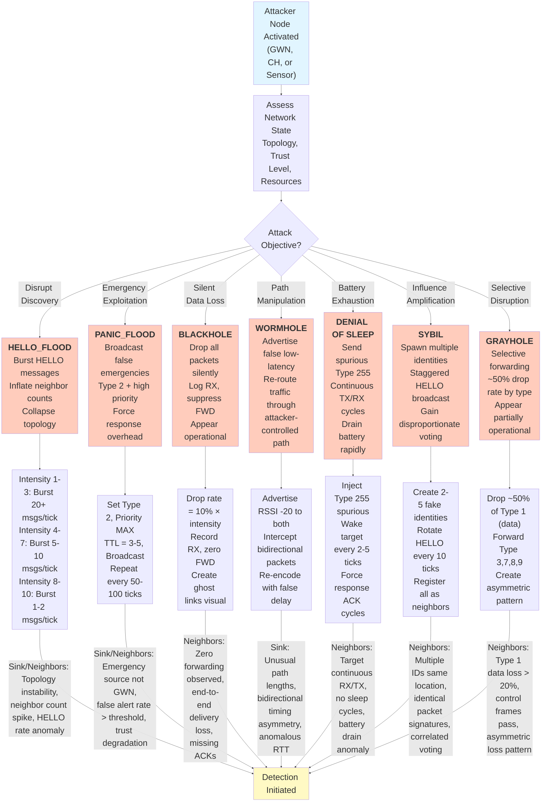

# WSN7 Attack Modus Operandi Flowchart

## Unified Attack Execution Flow

This document presents a single composite flowchart showing the logical progression and decision pathways for all 7 attack types in the WSN7 system. The flowchart illustrates how attackers select and execute attacks based on objectives and available resources.

## Attack Type Matrix

| Attack | Intensity Impact | Execution Method | Detection Signal |
|--------|------------------|------------------|----------|
| **HELLO_FLOOD** | Intensity 1-3: 20+ msgs/tick (aggressive) • Intensity 4-7: 5-10 msgs/tick (moderate) • Intensity 8-10: 1-2 msgs/tick (subtle) | Burst fake HELLO messages with inflated neighbor counts | Message count spike from single source |
| **PANIC_FLOOD** | Intensity 1-3: Every 50 ticks (aggressive) • Intensity 4-7: Every 75 ticks (moderate) • Intensity 8-10: Every 100 ticks (subtle) | Broadcast Type 2 messages with MAX priority, TTL 3-5 | Emergency rate spike, multiple false alerts |
| **BLACKHOLE** | Intensity 1: 10% drop • Intensity 5: 50% drop • Intensity 10: 100% drop (linear scaling) | Record all RX packets, suppress FWD to parent chain | End-to-end timeout, ghost links appear at attacker |
| **WORMHOLE** | Intensity 1-3: RSSI -18 (subtle advantage) • Intensity 4-7: RSSI -22 (moderate advantage) • Intensity 8-10: RSSI -25 (strong advantage) | Advertise false low-latency path between distant regions | Path length anomaly, unusual timing patterns |
| **DENIAL_OF_SLEEP** | Intensity 1: Wake every 10 ticks • Intensity 5: Wake every 5 ticks • Intensity 10: Wake every 2 ticks | Inject spurious Type 255 messages forcing TX/RX cycles | Battery drain rate > normal, continuous activity |
| **SYBIL** | Intensity 1-3: 2-3 fake identities (subtle) • Intensity 4-7: 3-4 identities (moderate) • Intensity 8-10: 5+ identities (aggressive) | Spawn multiple node IDs, stagger HELLO rotation every 10 ticks | Spatial clustering in same region, identical behavior patterns |
| **GRAYHOLE** | Intensity 1-3: ~20% Type 1 drop (subtle) • Intensity 4-7: ~35% Type 1 drop (moderate) • Intensity 8-10: ~50% Type 1 drop (aggressive) | Selective forwarding of Type 1 data only, pass control traffic | Asymmetric packet loss: data drops but control frames pass |

## Integration with Core Protocols

This flowchart integrates:
- **Type 3 (CLIP_CONTROL)**: Distributed consensus voting and anomaly escalation
- **Type 10 (ML_TUNING)**: Adaptive parameter propagation and threshold adjustment
- **Setup Phase**: Initial key exchange and topology establishment
- **Data Transmission**: Normal operation baseline for anomaly detection
