# WSN7 System Architecture Documentation

## Overview

This document provides comprehensive details on the WSN7 Modular Wireless Sensor Network system, including security protocols, data transmission pipelines, attack methodologies, and implementation details.

## Part 1: Setup Phase

### 5-Step GWN-to-Sink Key Exchange (Global Handshake)

The secure key exchange between a Gateway Node (GWN) and the Sink (root node) establishes the initial secure backbone connectivity.

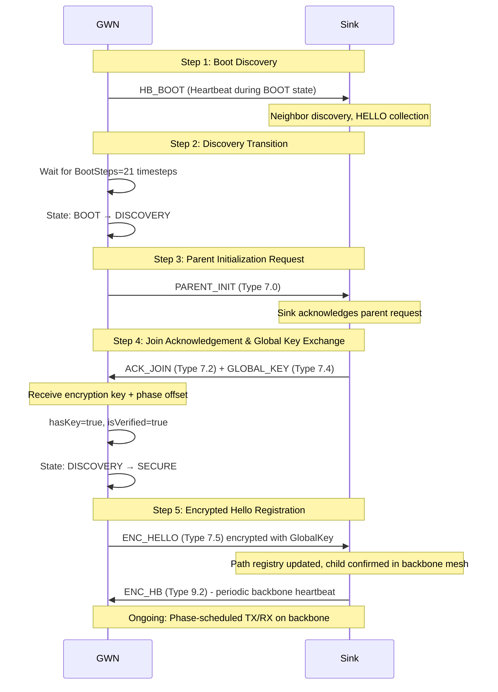

**Timing Details:**
- **t=0-20**: GWN BOOT state, boot discovery phase
- **t=21-200**: GWN DISCOVERY state, hello collection window (SetupTime=200)
- **t=200+**: CH/Sensor recruitment opens
- **t=300+**: Stable topology established

**Key Characteristics:**
- XOR-based symmetric encryption using GlobalKey
- Phase offset inheritance: Child receives opposite phase from parent
- Lock enforcement: Handshake partner is locked until ENC_HELLO confirmation
- ENC_HELLO retries with exponential backoff: t+10, t+30, t+70, etc.

### 3-Step CH-to-GWN Key Exchange (Cluster Head Recruitment)

Cluster Heads (CHs) establish secure routing through Gateway Nodes using a 3-step handshake on the Access radio.

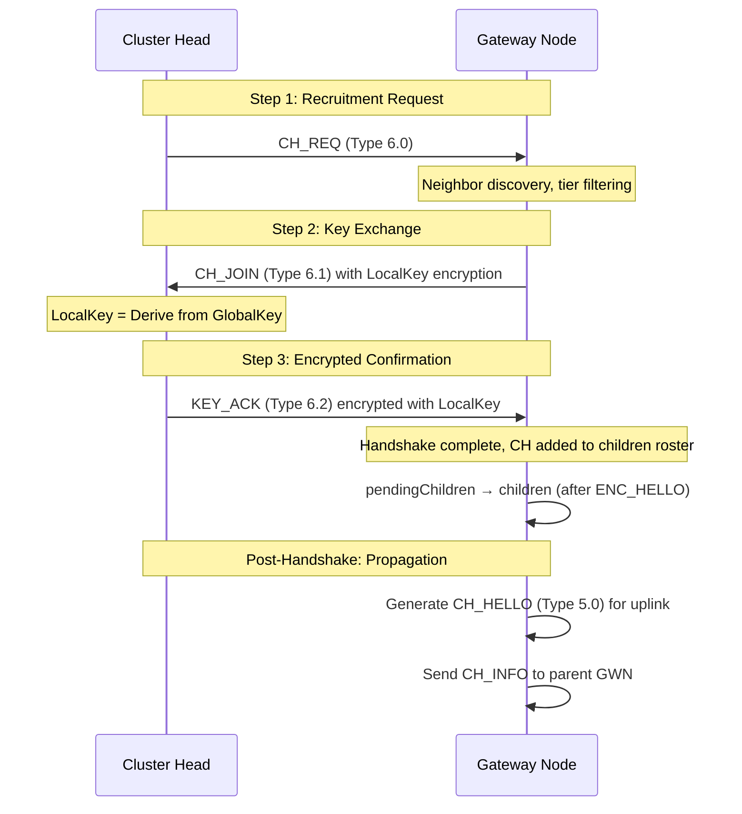

**Message Flow:**
1. **CH_REQ (6.0)**: Unencrypted, requests parent GWN
2. **CH_JOIN (6.1)**: Contains LocalKey encrypted with XOR cipher
3. **KEY_ACK (6.2)**: Confirmation encrypted with LocalKey

**State Transitions:**
- **pendingChildren**: CH added after ACK_JOIN, awaiting ENC_HELLO
- **children**: CH promoted after receiving ENC_HELLO from child GWN
- **HANDSHAKE state**: GWN locked during active handshake (max 5 retries, exponential backoff)

### 2-Step CH-to-CH Key Exchange (Peer Cluster Head Recruitment)

Cluster Heads can recruit nearby CHs or sensors using a simplified 2-step handshake via direct neighbor discovery.

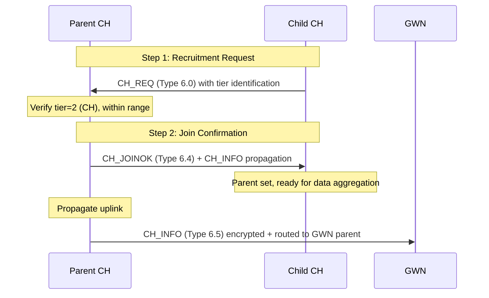

**Characteristics:**
- Simplified 2-step (vs 5-step GWN-Sink): No global key needed initially
- Uses local link encryption where available
- Immediate parent assignment after CH_JOINOK
- CH_INFO propagation creates awareness at GWN level

## Part 2: Data Transmission Pipeline

### Message Types and Structures

The WSN system uses a comprehensive message type system for different protocol phases and data flows:

| Type | Name | Purpose | Subtypes | Radio | Encryption |
|------|------|---------|----------|-------|-----------|
| 0 | HELLO | Neighbor discovery (verified GWNs only) | 0=Unverified, 1=Verified | Access + Backbone | None |
| 1 | SENSOR_DATA | Raw sensor readings to CH/GWN | 0=SENSOR_REPORT | Access | Optional |
| 2 | PANIC | Emergency/anomaly messages | TTL + Priority | Access | Optional |
| 3 | CLIP_CONTROL | Consensus & trust management | 3.0=CLIP_POLL, 3.1=CLIP_VOTE, 3.2=CLIP_RESULT | Access | LocalKey |
| 5 | CH_HELLO / SENSOR_AGG / AGG_ACK | CH routing + aggregated data | 5.0=CH_HELLO, 5.1=CH_ROUTING, 5.2=SENSOR_AGG, 5.3=AGG_ACK | Access | LocalKey (uplink) |
| 6 | CH_CMD | CH-GWN/CH-CH handshake | 6.0=CH_REQ, 6.1=CH_ACK, 6.2=KEY_ACK, 6.3=CH_REJECT, 6.4=CH_JOINOK, 6.5=CH_INFO | Access | LocalKey (6.1+) |
| 7 | CMD | GWN-GWN backbone routing | 7.0=PARENT_INIT, 7.1=REQ_JOIN, 7.2=ACK_JOIN, 7.3=PARENT_REJECT, 7.4=GLOBAL_KEY, 7.5=ENC_HELLO, 7.6=CMD_DOWN, 7.7=CMD_UP | Backbone | GlobalKey |
| 8 | ALERT | SINK DOWNSTREAM COMMUNICATION | 8.0 | Backbone+/Access | Optional |
| 9 | HEARTBEAT | Boot/discovery/encrypted backbone HB | 9.0=HB_BOOT, 9.1=HB_DISC, 9.2=ENC_HB | Both Radios | GlobalKey (9.2) |
| 10 | ML_TUNING | Adaptive parameter propagation | 10.0=TUNE_PROP, 10.1=TUNE_ASSIGN | Backbone/Access | GlobalKey (10.0), LocalKey (10.1) |

### Detailed Message Structure

#### Universal WSN_Message Header

```
┌─────────────────────────────────────────────────────────────┐
│                     MESSAGE HEADER                          │
├─────────────────────────────────────────────────────────────┤
│ Type (8-bit)      │ Message class (0-9)                     │
├───────────────────┼─────────────────────────────────────────┤
│ Subtype (8-bit)   │ Message variant within type             │
├───────────────────┼─────────────────────────────────────────┤
│ Src (16-bit)      │ Immediate sender Node ID (Hex)          │
├───────────────────┼─────────────────────────────────────────┤
│ Dst (16-bit)      │ Immediate receiver Node ID (Hex)        │
├───────────────────┼─────────────────────────────────────────┤
│ OriginalSrc (16)  │ Original message sender (globally enc)  │
├───────────────────┼─────────────────────────────────────────┤
│ Flag (8-bit)      │ Bit1=ENC, Bit2=VER, Bit3=GLOBAL_ENC,    │
│                   │ Bit4=DOUBLE_ENC                         │
├───────────────────┼─────────────────────────────────────────┤
│ Priority (8-bit)  │ 0=Normal, 1=High priority               │
├───────────────────┼─────────────────────────────────────────┤
│ TTL (8-bit)       │ Hop limit (default=5)                   │
├───────────────────┼─────────────────────────────────────────┤
│ Sequence (8-bit)  │ Packet sequence number                  │
├───────────────────┼─────────────────────────────────────────┤
│ Checksum (8-bit)  │ CRC for integrity verification          │
├───────────────────┼───────────── ───────────────────────────┤
│ UID (32-bit)      │ Unique packet identifier                │
└─────────────────────────────────────────────────────────────┘
```

#### Encryption Layers

```
┌──────────────────────────────────────────────────────────┐
│ Payload Layer Structure                                  │
├──────────────────────────────────────────────────────────┤
│ [Legacy Payload]          - Direct plaintext             │
│ [GlobalEncryptedPayload]  - XOR with GlobalKey           │
│ [DoubleEncryptedPayload]  - XOR(XOR(...))                │
│                             (Gateway ACK layer)          │
└──────────────────────────────────────────────────────────┘
```

**Encryption Algorithm:** Simple XOR-based symmetric cipher
- **Key Generation**: Sum of ASCII values → single-byte key
- **Symmetric**: encrypt(X, K) = decrypt(X, K)
- **GlobalKey**: Randomized at Each Sink Startup (AES format)
- **LocalKey**: Derived from GlobalKey via `deriveLocalKey()` function

### Data Aggregation at Cluster Head

CHs perform periodic sensor data collection and aggregation:

**Aggregation Process:**
1. **Collection Phase** (t = 0 to t_agg):
   - CH collects SENSOR_DATA messages from child sensors
   - Stores in local aggregation buffer
   - Timeout: Aggregation window ≤ 50 timesteps

2. **Aggregation Logic**:
   - **Averaging**: Compute mean of all sensor readings
   - **Binning**: Group readings by sensor ID
   - **Timestamping**: Mark aggregation completion time
   - **Payload Encoding**: Pack binary data (min/max/avg/count)

3. **Message Creation**:
   ```
   Type: 5 (SENSOR_AGG / DATA_AGG)
   Subtype: 5.2
   Payload: [SensorID_1|Value_Avg|Count][SensorID_2|...]
   Encryption: LocalKey (if parent GWN)
   Destination: Parent GWN or Parent CH
   ```

4. **Forwarding Queue**:
   - Queue aggregated message to Q_local on backbone
   - Awaits phase scheduling (TX phase window)
   - Maximum queue size: 15 messages

CHs transition through states: IDLE (awaiting sensors) → COLLECTING (gathering data) → COMPLETE (window closed) → SENT (message forwarded) → IDLE.


### ACK Exchange at GWN-CH Interface & Double Encryption

**Acknowledgment Protocol:**

1. **ACK Request** (CH → GWN):
   ```
   Type: 5 (CH_HELLO / SENSOR_AGG)
   Subtype: 5.3 (AGG_ACK)
   Flag: Bit1=ENC (encrypted with LocalKey)
   Payload: [Seq#|Timestamp|ACK_Status]
   ```

2. **ACK Response** (GWN → CH):
   ```
   Type: 5
   Subtype: 5.3
   Flag: Bit2=VER (verified), Bit4=DOUBLE_ENC
   Payload: GlobalEncrypted[LocalEncrypted[ACK]]
   ```

3. **Double Encryption at GWN**:
   - **Layer 1 (LocalKey)**: CH-GWN link encryption
   - **Layer 2 (GlobalKey)**: GWN-Sink backbone encryption
   
   ```
   Original: [ACK_Payload]
   Step 1 (LocalKey): Enc1 = XOR([ACK_Payload], LocalKey)
   Step 2 (GlobalKey): Enc2 = XOR(Enc1, GlobalKey)
   
   Decryption (reverse):
   Dec1 = XOR(Enc2, GlobalKey)  // Recover Enc1
   Dec2 = XOR(Enc1, LocalKey)   // Recover original
   ```

4. **Gateway ACK Handling**:
   - GWN receives encrypted ACK from CH
   - Decrypts with LocalKey
   - Re-encrypts with GlobalKey for uplink
   - Forwards to parent GWN/Sink
   - Updates CH status in neighbor registry

**ACK Timeout & Retry:**
- Initial timeout: 5 timesteps
- Retry count: ≤ MAX_RETRIES (5)
- Exponential backoff: 5, 10, 20, 40, 80 timesteps

### Phased Queue Implementation at Gateway Nodes

The phase-based scheduling system replaces token-gating for backbone traffic control:

**Phase Cycle**: 6 timesteps per cycle. First 3 timesteps (positions 0-2) are TX phase, last 3 (positions 3-5) are RX phase. Phase is computed as phase(t) = f(GlobalKey, t) XOR phaseOffset. Child nodes receive opposite phase offset from parent, so when parent is in TX mode, child may be in RX mode (staggered). This creates natural collision avoidance without explicit coordination.

**Queue Priority & Scheduling:**

```
┌─────────────────────────────────────────────────────────┐
│          GWN Queue Management System                    │
├─────────────────────────────────────────────────────────┤
│ Q_fwd (Forwarding Queue)    │ Max: 15 messages          │
│  - Child→Parent relay       │ Priority: HIGHEST         │
│  - Strict FIFO order        │ Purge: 3 if full          │
├─────────────────────────────┼───────────────────────────┤
│ Q_local (Local Queue)       │ Max: 15 messages          │
│  - Own data (CH_HELLO, AGG) │ Priority: NORMAL          │
│  - Sensor aggregation       │ Purge: 3 if full          │
├─────────────────────────────┼───────────────────────────┤
│ Control Traffic (Exempt)    │ Always transmittable      │
│  - Type 7 (CMD)             │ Type 8 (TOKEN)            │
│  - Type 9 (HEARTBEAT)       │ No queue/phase wait       │
└─────────────────────────────────────────────────────────┘
```

**TX Phase Scheduling:**

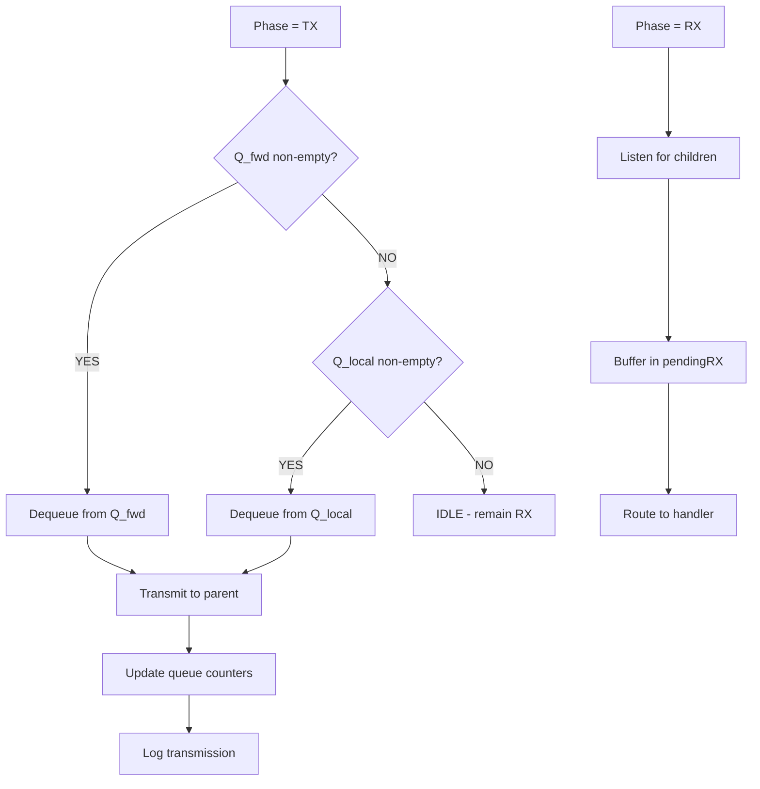

**Sink Special Behavior:**
- Default to RX unless queues have pending data
- Can TX during TX phase if backlog exists
- Q_fwd has higher priority than Q_local
- Maintains path registry for all children

**Queue Purge Policy:**
- Trigger: Queue size > max (15)
- Action: Remove oldest 3 messages
- Reason: FIFO buffer overflow prevention
- Log: Records purge event with timestamp

## Part 3: Type 3 — CLIP Control Messages

**Type 3** implements consensus-based voting for anomaly reporting. Nodes detect suspicious patterns, broadcast polls with bounded TTL, receive votes from neighbors based on historical trust, and escalate results upward to the Sink. The protocol avoids feedback loops by keeping voting independent from parameter tuning.

### Type 3.0 — CLIP_POLL (Poll Initiation)

Initiates a distributed vote on a suspect node. Broadcasting node specifies the attack class and TTL scope.

**Message Structure:**
| Field | Size | Purpose |
|-------|------|---------|
| Type | 8-bit | 3 |
| Subtype | 8-bit | 0 (CLIP_POLL) |
| poll_id | 16-bit | Unique poll identifier |
| initiator_id | 16-bit | Node that initiated poll |
| suspect_id | 16-bit | Node under suspicion |
| suspicion_class | 8-bit | Attack type (0x01-0x07, 0xFF=unknown) |
| ttl | 8-bit | 1 = local neighbors, 2 = extended via CH |
| timeout | 8-bit | Voting window duration (timesteps) |

**Suspicion Classes**: 0x01=HELLO_FLOOD, 0x02=PANIC_FLOOD, 0x03=BLACKHOLE, 0x04=WORMHOLE, 0x05=DOS_SLEEP, 0x06=SYBIL, 0x07=GRAYHOLE, 0xFF=UNKNOWN.

**Behavior**: Broadcasting node detects anomalies (excessive HELLOs, repeated PANICs, retransmission patterns) and sends CLIP_POLL to immediate neighbors. Suspect node ignores the poll silently. Neighbors forward only if they have seen the suspect before and haven't already received this poll_id.

### Type 3.1 — CLIP_VOTE (Local Vote)

Records a node's assessment of the suspect based on historical trust patterns, not current behavior.

**Message Structure:**
| Field | Size | Purpose |
|-------|------|---------|
| Type | 8-bit | 3 |
| Subtype | 8-bit | 1 (CLIP_VOTE) |
| poll_id | 16-bit | References originating CLIP_POLL |
| voter_id | 16-bit | Voting node ID |
| suspect_id | 16-bit | Node under suspicion |
| vote | 8-bit | 0=NO (trusted), 1=YES (suspicious) |
| confidence | 8-bit | Trust in vote (0-100%) |
| trust_snapshot | 32-bit | Historical trust score at voting time |

**Behavior**: Voting node analyzes historical record of suspect over 100-500 timestep window. Vote reflects patterns (battery anomalies, message timing irregularities) seen previously, not immediate context. Confidence ranges from 90-100% (strong evidence) down to <50% (uncertain). Each node votes once per poll; duplicate votes from alternate paths are dropped.

### Type 3.2 — CLIP_RESULT (Consensus Result & Escalation)

Aggregates votes and escalates consensus decision to Sink via parent chain for global trust updates.

**Message Structure:**
| Field | Size | Purpose |
|-------|------|---------|
| Type | 8-bit | 3 |
| Subtype | 8-bit | 2 (CLIP_RESULT) |
| poll_id | 16-bit | Original poll identifier |
| initiator_id | 16-bit | Poll initiator |
| suspect_id | 16-bit | Suspect node |
| yes_count | 8-bit | Votes for suspicious |
| no_count | 8-bit | Votes for trusted |
| weighted_score | 16-bit | Aggregated trust score (0-1000) |
| action_taken | 8-bit | Local response: 0x00=NONE, 0x01=MONITOR, 0x02=ISOLATE, 0x03=BLACKLIST, 0x04=ESCALATE |
| cluster_id | 16-bit | Originating cluster |
| timestamp | 32-bit | Result generation time |

**Behavior**: After poll closes, initiating node (or designated aggregator) computes consensus: weighted_score = (yes_count × 100) - (no_count × 50), biased toward caution. If yes_count / total_votes > 60%, action_taken is set to LOCAL_ISOLATE or LOCAL_BLACKLIST; otherwise NO_ACTION. Message routed via parent chain using Q_fwd priority. At Sink, CLIP_RESULT is recorded in global_trust_matrix; multiple CLIP_RESULTs from different clusters for same suspect triggers recalibration broadcast (Type 10).

## Part 4: Type 10 — ML_TUNING Parameter Propagation

**Type 10** distributes adaptive monitoring parameters from Sink down through the GWN backbone. Instead of retraining ML models at resource-constrained edge nodes, the Sink computes 4-digit tuning keys encoding parameter sensitivity (RSSI, queue anomalies, retransmissions, duty cycles) and propagates them efficiently via hierarchical repacking. Nodes apply tuning immediately upon reception with no restart required.

### Type 10.0 — TUNE_PROP (Multi-Node Tuning Propagation)

Broadcasts tuning parameters from Sink with efficient node-range encoding for hierarchical repacking as the message propagates downward.

**Message Structure:**
| Field | Size | Purpose |
|-------|------|---------|
| Type | 8-bit | 10 |
| Subtype | 8-bit | 0 (TUNE_PROP) |
| tuning_epoch | 16-bit | Generation time at Sink |
| cluster_id | 16-bit | Target cluster identifier |
| entry_count | 8-bit | Number of (node_range, tuning_key) entries |
| entries[] | Variable | Array of tuning assignments (see below) |

**Entry Structure (per item in entries[]):**
| Field | Size | Purpose |
|-------|------|---------|
| node_range_start | 16-bit | Node ID range start (e.g., 0xAA00) |
| node_range_end | 16-bit | Node ID range end (e.g., 0xAA1F) |
| tuning_key | 16-bit | 4-digit code (0x7314) |

**Tuning Key Encoding** (4 digits, each 1-9):
- Digit 1: RSSI sensitivity (1-3=low, 4-6=medium, 7-9=high)
- Digit 2: Queue anomaly weight (1-3=low, 4-6=medium, 7-9=high)
- Digit 3: Retransmission emphasis (1-3=low, 4-6=medium, 7-9=high)
- Digit 4: Duty-cycle monitoring (1-3=low, 4-6=medium, 7-9=high)

Example: tuning_key=0x7314 means high RSSI monitoring, medium queue weight, low retransmission emphasis, medium duty-cycle monitoring.

**Behavior**: Sink broadcasts TUNE_PROP with one or more entries mapping node ranges to tuning keys. Each intermediate GWN node receives the message, extracts entries matching its direct children, sends individual TUNE_ASSIGN messages to those children, and repacks remaining entries for downward propagation. This hierarchical approach reduces bandwidth by ~70% vs. flooding to all nodes. Entries are dropped when all nodes in range are served.

### Type 10.1 — TUNE_ASSIGN (Final Node Assignment)

Unicast message delivering tuning parameters to individual node.

**Message Structure:**
| Field | Size | Purpose |
|-------|------|---------|
| Type | 8-bit | 10 |
| Subtype | 8-bit | 1 (TUNE_ASSIGN) |
| node_id | 16-bit | Target node identifier |
| tuning_epoch | 16-bit | Which tuning epoch (matches TUNE_PROP) |
| tuning_key | 16-bit | 4-digit tuning code for this node |

**Behavior**: Sent by CH or GWN directly to a child node (Sensor or lower-tier CH). Upon reception, node decodes the 4-digit tuning_key into parameter thresholds: RSSI sensitivity = 0.5 × (digit1 / 5), queue weight = digit2 / 10, retransmit multiplier = 1.0 + (digit3 - 5) × 0.2, duty window = 100 + digit4 × 20. Thresholds update immediately in the node's anomaly detector without restart. Example: a node receiving 0x7314 immediately becomes sensitive to weak RSSI signals while ignoring queue anomalies, suitable for networks where HELLO_FLOOD attacks are active.

## Part 5: Attack Methodology

### Overview of Attack Types

The WSN system implements 7 distinct attack vectors with tunable intensity (1-10):

- **Intensity 1-3**: Easily detectable (aggressive, constant)
- **Intensity 4-7**: Moderately detectable (intermittent)
- **Intensity 8-10**: Hard to detect (subtle, rare, node often normal)

### Attack 1: Hello Flood

**Objective**: Disrupt neighbor discovery by flooding the network with fake HELLO messages.

**Implementation:**

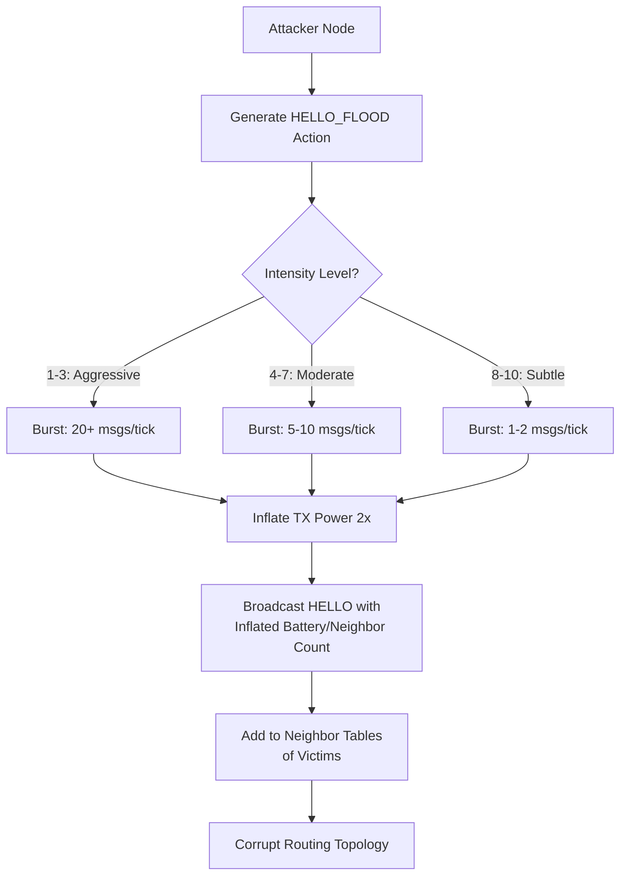

**Payload Structure:**
```
Type: 0 (HELLO)
Subtype: 0 (Unverified flood)
Payload: [Tier=3|Battery=100%|Neighbors=999]
TX Power: 2x normal (creates false long-range impression)
Color: Bright Pink [1.0, 0.0, 0.5]
```

**Behavioral Signature:**
- Excessive HELLO messages from single node
- Unrealistic neighbor counts (>20)
- Rapid battery drain paradox (always 100%)
- Network topology churn (frequent parent changes)

**Detection:**
- Count HELLO messages per node per interval
- Flag if > 2 per 100 timesteps
- Check battery consistency
- Verify neighbor count matches actual topology

### Attack 2: Panic Flood

**Objective**: Trigger false emergency alerts, causing resource exhaustion and denial of service.

**Implementation:**

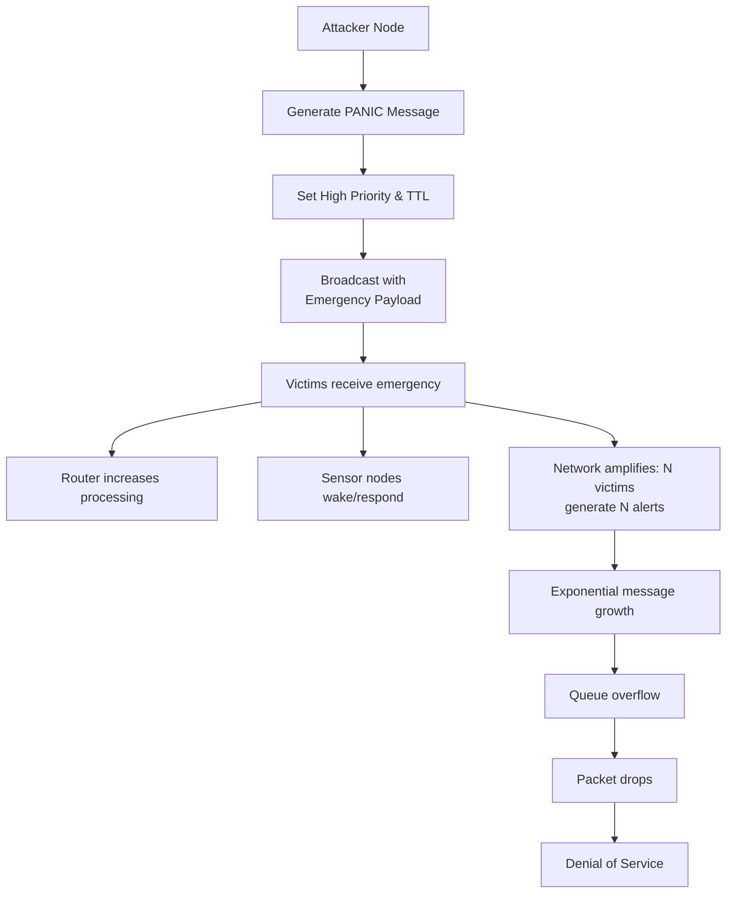

**Payload Structure:**
```
Type: 2 (PANIC)
Subtype: Variable (1-5)
Flag: Bit2=VERIFIED (spoofed)
Priority: 1 (HIGH)
TTL: 10 (max hops)
Payload: [Severity=CRITICAL|SensorID|Alert_Type]
Color: Bright Red [1.0, 0.0, 0.0]
Cooldown: Random 10-30 timesteps between floods
```

**Rate-Limiting:**
- Sender enforces minimum cooldown per node
- Cooldown increases with intensity
- Tracking: `panicLastTick`, `panicCooldown` per attacker

**Behavioral Signature:**
- Periodic PANIC bursts from single source
- High TTL values (>5)
- Priority=1 consistently
- Destination multicast broadcast (FFFF)

**Detection:**
- Count PANIC messages per node per 100 TF interval
- Flag if > 1 per interval
- Validate emergency source (should be Sink/GWN only)
- Check TTL reasonableness

### Attack 3: Blackhole

**Objective**: Drop all data packets silently, creating a sinkhole that appears operational.

**Implementation:**

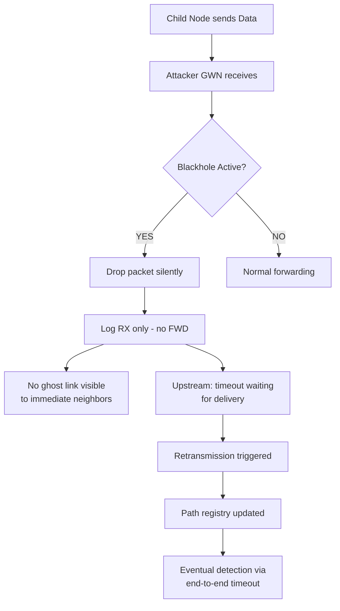

**Drop Decision**: Attacker decides to drop based on intensity parameter. Intensity 1 produces 10% drop rate, intensity 10 produces 100% drop rate. A random check on each packet determines whether to drop or forward.

**Ghost Link Visualization**: When a packet is dropped, a ghost link is created from the attacker node to the intended parent (where the packet should have gone), visible for 3 timesteps, colored dark gray to indicate absorption/failure.

**Behavioral Signature:**
- Packets received from children, none forwarded
- Q_fwd queue constantly full
- No ENC_HELLO retries (node isolated)
- Sensor data never reaches Sink
- No error messages (silent failure)

**Detection:**
- End-to-end delivery timeout (>10 hops expected, none received)
- Timeout rate > 5% at suspect node
- Q_fwd saturation for >50 timesteps
- Check uplink path: all children affected simultaneously

### Attack 4: Wormhole

**Objective**: Create a false tunnel between distant network regions, re-routing traffic through attacker-controlled path.

**Implementation:**

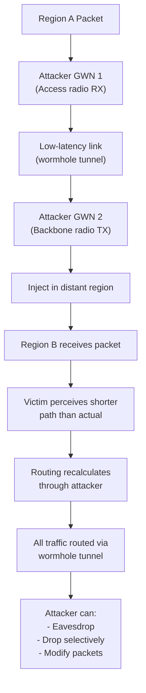

**Wormhole Endpoints:**
```matlab
% Two attacker nodes with direct link
Attacker1 (GWN_A): Access Radio → Backbone Radio
              ↓ (low-latency tunnel, no hops)
Attacker2 (GWN_B): Backbone Radio → Access Radio

Metrics:
- Bandwidth per tick: 1 message
- Latency: 1 timestep (vs 5-10 normal)
- Link stability: 100% (no fading)
```

**Behavioral Signature:**
- Two attacker nodes with unexplainable proximity
- Short paths to distant regions appearing
- Sudden routing changes favoring attacker nodes
- Zero packet loss on attacker's "tunnel"
- Other paths show degradation (traffic redirected)

**Detection:**
- Path length analysis: Compare topology distance vs logical hops
- Link quality monitoring: Zero loss on unlikely paths
- TTL analysis: Packets arriving with unusual TTL values
- Timing correlation: Identical RTT delays on distant paths

### Attack 5: Denial of Sleep

**Objective**: Prevent sensor nodes from entering sleep mode, draining their batteries (Vampire attack).

**Implementation:**

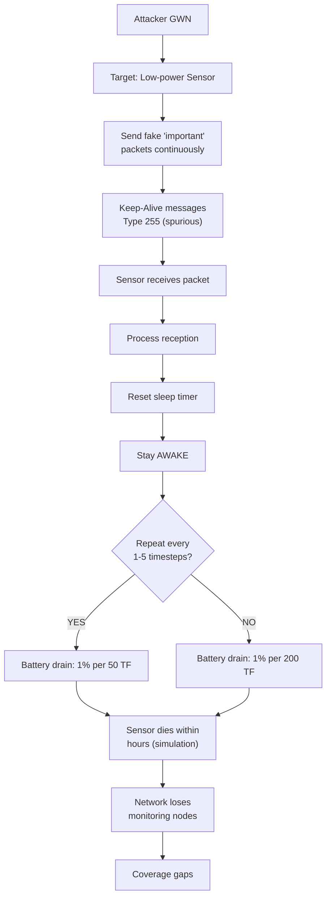

**Wake Packet Structure**: Attacker sends Type 255 spurious messages with spoofed timestamps to appear legitimate. Frequency varies by intensity: 1-3 (5 msgs/TF, aggressive), 4-7 (2 msgs/TF, moderate), 8-10 (1 msg/TF, subtle). Payload contains SrcID and fake data.

**DoS Target Tracking**: System tracks denialLastWakeTick (last wake message time), denialWakeCount (total wakes), and dosTargets list for visualization. Active DoS campaigns show as double-line links from attacker to victim node.

**Behavioral Signature:**
- Specific sensor node(s) battery drops unusually fast
- Node receives packets at high rate (>10 per 100 TF)
- Packets often identical or nearly identical
- Node never enters sleep state
- Energy drain: >0.5% per timestep on affected node

**Detection:**
- Monitor battery drain rate per node
- Flag if > 1% per 20 timesteps (normal ~1% per 200 TF)
- Analyze received packet pattern: high rate from single source
- Check packet originality: many duplicates/similar content
- Correlate sleep state with received packets

### Attack 6: Sybil Attack

**Objective**: Impersonate multiple identities simultaneously, gaining disproportionate influence in the network.

**Implementation:**

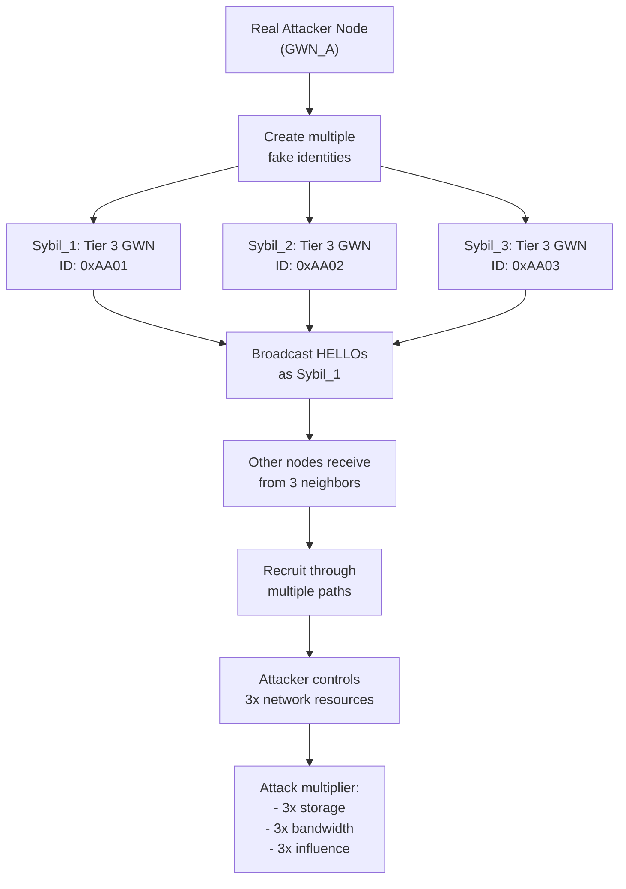

**Identity Rotation**: Due to half-duplex radio constraint, Sybil identities are staggered: Sybil_1 broadcasts at t=100, Sybil_2 at t=102, Sybil_3 at t=104. Each identity appears roughly every 3 timesteps, creating illusion of separate nodes to victims.

**Sybil Identity Tracking**: System maintains sybilIdentities array (e.g., 0xAA01, 0xAA02, 0xAA03), injection ticks for each, tier assignments, and currently active identity. Sybil identities are color-coded: Sybil_1 orange, Sybil_2 light orange, Sybil_3 light red, with additional colors for larger Sybil armies.

**Behavioral Signature:**
- Multiple new neighbors appearing from same location
- HELLO messages from neighbors with identical/very similar characteristics
- Unlikely clustering of nodes (all at same coordinates)
- Simultaneous HELLO bursts (all at t+1, t+2, etc.)
- All identities recruit via same parent
- Synchronized neighbor table updates

**Detection:**
- Spatial clustering: Group nodes by location, flag if >1 node per location
- Behavior correlation: Identical RSSI/battery patterns from cluster
- Recruitment pattern: All identities recruit same children
- Timing analysis: Regularly-spaced HELLO generation from cluster
- MAC address verification: If available, check for spoofing

### Attack 7: Denial of Service via Selective Forwarding (Grayhole)

**Objective**: Selectively forward or drop packets based on content, disrupting specific flows while appearing operational.

**Implementation:**

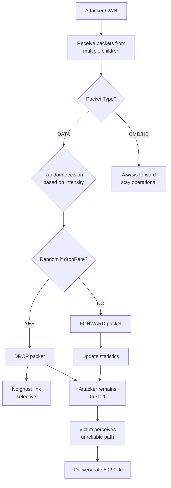

**Drop Strategy**: Attacker calculates dropRate = intensity / 10.0 (e.g., intensity 5 = 50% drop). To avoid detection, if recent drop history exceeds 90%, the attacker allows packets through to maintain operational appearance. Random check per packet determines drop vs. forward.

**Key Difference from Blackhole:**
- **Blackhole**: Drop ALL packets (100%)
- **Grayhole**: Drop ~50% (intensity dependent)
- **Effect**: Appears as unreliable link, not broken link
- **Detection**: Much harder (looks like normal fading)

**Behavioral Signature:**
- Consistent packet loss ~50% from single node
- Only affects DATA packets (CMD/HB always arrive)
- No correlation with signal strength/RSSI
- Sibling nodes see different loss rates (selective)
- Problem persists even after route recalculation

**Detection:**
- Per-child packet delivery ratio monitoring
- Temporal pattern analysis: Loss rates >20% sustained
- Cross-validation: Check sibling nodes' delivery to same parent
- Packet type analysis: Selective loss pattern (data vs control)
- Loss correlation: Should decrease with signal strength (not for grayhole)

## Attack Detection Summary Table

| Attack | Detection Method | Confidence | False Positive Rate |
|--------|------------------|------------|---------------------|
| Hello Flood | Message count spike | High | Low (<5%) |
| Panic Flood | Emergency source validation | High | Medium (10%) |
| Blackhole | End-to-end timeout + ghost links | High | Medium (10%) |
| Wormhole | Path length anomaly analysis | Medium | High (20%) |
| DoS/Sleep | Battery drain rate + packet timing | Medium | Medium (15%) |
| Sybil | Spatial clustering + behavior correlation | Medium | High (25%) |
| Grayhole | Selective loss pattern + type analysis | Low | High (30%) |

## Protocol Timeline Summary

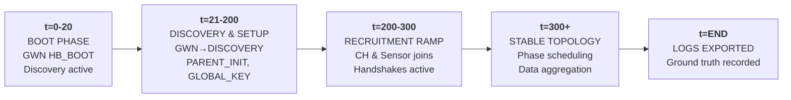

## Configuration Parameters

**Timing:** BootSteps=21, SetupTime=200, HelloInterval=500, AggressiveInterval=50, HandshakeTimeout=100

**Queue Management:** QUEUE_FWD_MAX=15, QUEUE_LOCAL_MAX=15, QUEUE_PURGE_COUNT=3

**Phase Scheduling:** PHASE_CYCLE_LENGTH=6, PHASE_TX_DURATION=3, PHASE_RX_DURATION=3, PHASE_START_TIME=300

**Crypto:** GlobalKey randomized at each Sink startup; LocalKey derived from GlobalKey; XOR-based symmetric encryption

**Thresholds:** CH_GWN_RSSI_Threshold=0.5, Sensor_CH_RSSI_Threshold=0.5, Sensor_GWN_RSSI_Threshold=0.4, MinBootNeighbors=1

**Document Version**: 2.1  
**Last Updated**: 2026-05-06  
**System**: WSN7 Modular Wireless Sensor Network Simulator

**Related Documents:**
- [WSN_SYSTEM_ARCHITECTURE_IDEATION.md](WSN_SYSTEM_ARCHITECTURE_IDEATION.md) — Integration strategies, implementation phases, architectural benefits

